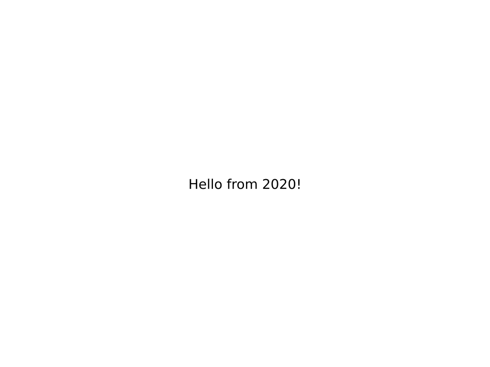

# Elsie
**Elsie** allows you to **create slides programmatically** using Python.

*Elsie* is a Python library that lets you build
[SVG](https://en.wikipedia.org/wiki/Scalable_Vector_Graphics) slides in a
composable way and then render them to PDF. There is no DSL or GUI –
presentations created with *Elsie* are fully programmed with Python.

## Hello world
```python
import elsie, datetime

slides = elsie.Slides()

@slides.slide()
def hello_world(slide):
    this_year = datetime.datetime.now().year
    slide.text(f"Hello from {this_year}!")

elsie.render("slides.pdf")
```


## Features

- **Fully programmable presentations** If you have a repeated pattern in slides,
  you do not have to recreated it manually, you have Turing-complete Python.

- **Automatic layout** *Elsie* provides a simple yet powerful layout model. Need
  rows? Columns? Grids? Padding? Aligned text? Relative/Absolute positioning?
  Automatic scaling? We got you covered.

- **Animations and fragments** Reveal your slides gradually using fragments or
  create custom step-by-step animations using Python code. Or draw a fine-tuned
  SVG image by hand in `Inkscape` and let *Elsie* turn it into an animation
  using a handy [layer-naming convention](TODO).

- **Source code highlighting** Enjoy automatic [source code highlighting](TODO).
  Create code walkthroughs using individual line highlighting or arrows pointing
  to specific code elements.

- **Batteries included** Leverage familiar SVG features - fonts, colors, dashed
  line borders, you name it. Include `PNG/JPG/SVG` images directly into your
  slides. Render [LaTex](TODO) into your slides. Debug your slides interactively
  in [Jupyter notebooks](TODO).

- **Familiarity** At its heart, *Elsie* is an API for creating SVG images,
  optimized for making slides. If you know basics of Python and SVG, you'll be
  right at home.

Every tool has its disadvantages though.

- *Elsie* provides a rather low-level API. While that means that you can create
  a slide in any way you like, on the other hand you also sometimes have to do
  some extra work to achieve results. But once you do it, you can create
  function for it and never repeat the work again.
- *Elsie* produces PDF slides, so it can only create animations with a single
  frame per slide. If you need 60 FPS animations or GIFs, this tool is not for you.
- Currently, *Elsie* renders SVG slides to PDF using `Inkscape`. Therefore you
  must have it installed on your system for it to work. We provide a [Docker
  image](installation.md#docker-installation) with `Inkscape` for convenience.
- Elsie is not tested only on Linux machines, if you find a problem on a
  different system, do not hasitate to open an GitHub issue.

## How does it work?
TOOD: Inkscape, queries, pillow, etc.
