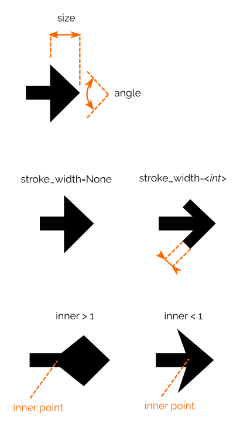

# Elsie: User Guide
Elsie is a framework for making slides using Python.
Its API allows you to build SVG slides programmatically.
Inkscape is then used in the background to render SVG into PDF slides.

Full demonstration:
  * Result: [example.pdf](../examples/bigdemo/example.pdf)
  * Source code: [example.py](../examples/bigdemo/example.py)

## About this text
The main purpose of this text is to create a complete reference for Elsie, where
you can find all the various features that Elsie offers. While this text prioritizes
completeness, it tries to be accessible as much as possible. If you find
something that you do not understand, please let me know.

If you are looking for a more tutorial-like material, try to look at the example
above.

## Installation

### Requirements

* Python 3.6+
* Inkscape 0.92+ (version 1.0+ recommended)
* (Optional for LaTeX support): pdflatex, pdf2svg

### Installation of Elsie

`$ pip3 install elsie`

### Installation of Inkscape
Install manually Inkscape (e.g. `$ apt install inkscape` in Ubuntu).

## Hello world example
The minimal slide in Elsie can be created in the following way:

```python
import elsie

@elsie.slide()
def hello(slide):
    slide.text("Hello world!")

elsie.render()  # Creates file 'slides.pdf'
```

The following code creates a pdf file with the following slide:


## Global slides
Functions like ``elsie.slide()`` or ``elsie.render()`` operate on a global
implicit instance of slides. It is common to build a single presentation inside a single
Python program, and using a global slides variable makes that easier. It will be be mostly used in
this text. You can find out how to create slides independently in [More instances of
slides](#more-instances-of-slides)


### Configuring global slides

By default, slides are created with ratio 4:3. More precisly, canvas 1024x768px
canvas is used as the default. However, as long everything is processed as
vector graphics, the exact numbers only influences numeric values of
coordinates, not the resulting resolution.

You can change this by the following code:

```python
# Setup slide size as 192x1035, i.e. 16:9

import elsie

slides = elsie.Slides(width=1920, height=1035)
elsie.set_global_slides(slides)
```

Another usefull argument is ``Slides`` is ``bg_color`` that allows to change default
background of the slides. The default color is white.

Note that configuration of global slides has to be done before creating the first slide.


## Creating slides

Slides are created in Elsie by creating a function and decorating it by
decorator ``@elsie.slide()``. It will create a slides in the same order as the
functions were defined. The decorated function should take a single parameter
that is the root box (see below) that represents the whole are of the slide.


```python
import elsie

@elsie.slide()
def slide1(slide):
    slide.text("First slide")

@elsie.slide()
def slide2(slide):
    slide.text("Second slide")

elsie.render()  # Creates two slide presentation.
```


## Boxes

The most prominent objects in Elsie are boxes. They serve as a layout mechanism
and the way how to put a content into a slide.

### Creating boxes

Let us create the following example, where 3 boxes are created from the
top-level box. The new box is created by calling `.box(...)` on an existing box.
The parameter ``slide`` passed into the slide function is also a box.

```python
@elsie.slide()
def boxdemo1(slide):
    slide.box().text("Box 1")
    slide.box().text("Box 2")
    slide.box().text("Box 3")
```

The code will create the following slide:


Boxes do not produce any visible content but it influence positions of other
elements. To see where the boxes are, we can switch on the box debug mode:

```python
@elsie.slide(debug_boxes=True)
def boxdemo1(slide):
    slide.box().text("Box 1")
    slide.box().text("Box 2")
    slide.box().text("Box 3")
```


Here we see the four boxes, the top-level box representing the whole slide and
three inner boxes.

Newly created boxes have the following behavior as default:
- It occupies as less space as possible (in our case is only as big as it could
  contain the text)
- Boxes are put verticaly in the order as they were defined
- They are centered vertically and horizontally.

In the text below, we will see how these default positioning and sizes can be changed.

Boxes can be hierarchically composed (parameter ``padding`` creates a padding in
all directions, it will be explained later).

```python
slide.box(padding=40).box(padding=40).box(padding=40).text("Box 1")
```


### Tree of boxes

Boxes creates a tree of *boxes* and *box items*. Boxes creates layout and box items
represents paitable contant as text, pictures, etc.
Box items are always leaves of the tree and does not contain child boxes.

When a slide is rendered, the box tree is traversed in depth-first way and each child is visited in the order in which it was defined.

This can be modified by parameters ``above``, ``below`` and z-level, see [Modifying painting order](#modifying-painting-order).

Allmost all methods on box creates a new boxes (e.g. ``box``) or box items (e.g. ``text`` or ``rect``). Actually all these methods are also provided by box items; however as box items cannot directly contain its own child elements, they are created in the parent box of the box item. Therefore the following two slides creates the equivalent slides:

```python
@elsie.slide()
def textrect_v1(slide):
    box = slide.box()
    box.rect(bg_color="#aaf")
    box.text("Hello!")

@elsie.slide()
def textrect_v2(slide):
    slide.box().rect(bg_color="#aaf").text("Hello!")
```


### Box naming

Box can be named by calling ``.box(name="Box name")``. It has no impact on
normal rendering of the slide. The name of slide is shown when
argument ``debug_boxes=True`` is used.

The name of the top-level slide is name of the slide function when the decorator
``@elsie.slide()`` is used to create the slide.


### Width and Height

Width and height of a box can be changed by setting ``width`` and ``height`` arguments when calling ``.box(...)`` method.

```python
@elsie.slide(debug_boxes=True)
def sizedemo1(slide):
    slide.box().text("Box 1")
    slide.box(width=300, height=100).text("Box 2")
    slide.box(width="100%").text("Box 3")
```


These paramters define **minimal** size of the box. This mean that when its
content (child boxes, texts, etc.) request a bigger size, the box will use the
requested size of the content.

The value should be one of the following:

* ``None`` (default): No minimal size request
* ``int``, ``float``, or a string containg only digits: Size defined in pixels
* String in format ``"XX%"`` where XX is a number (e.g. ``"50%"``): Size defined
  in percentage of the parent box size.
* String ``"fill"`` or ``"fill(XX)"`` where XX is a number. The box fills all
  available space of the parent box. If more boxes on the same level use filling
  value then the size is distributed respecting the ratio of parameters. For
  example, when one box has argument ``fill(2)`` and second one ``fill(3)``,
  remaining size will be divided in ratio 2:3. Value ``"fill"`` is shortcut for
  ``"fill(1)"``.

The following code shows example of "fill" usage:

```python
@elsie.slide(debug_boxes=True)
def filldemo1(slide):
    slide.box().text("Box 1")
    slide.box(width=300, height=100).text("Box 2")
    slide.box(height="fill").text("Box 3")
```


### Box aliases

New box can be created also by calling methods ``fbox``, ``sbox``, and ``overlay``.

* Method ``fbox(...)`` (fill-box) is a shortcut for calling ``box(width="fill", height="fill", ...)``.
* Method ``sbox(...)`` (stretch-box) is a shortcut for
calling ``box(width="fill", ...)`` if the parent box is vertical and
``box(width="fill", ...)`` if the parent box is horizontal.
In other words, it fills the box in the unmanaged direction.
* Method ``overlay(..)`` is a shortcut for ``box(x=0, y=0, width="100%", height="100%)``.


### Padding

By default, box gives all its space to its children. This can be controlled by
padding. There are four padding values: left, right, top, and bottom. There are
controlled by parameters ``p_left``, ``p_right``, ``p_top``, and ``p_bottom``.
After the layout of parent box is computed and the final size and position is
given to a box, padding shrinks its size in the specified directions.

Padding can also be set through the following parameters:
* ``p_x`` that sets ``p_left`` and ``p_right``
* ``p_y`` that sets ``p_top`` and ``p_bottom``
* ``padding`` that sets all four paddings.

```python
@elsie.slide(debug_boxes=True)
def padding_demo(slide):
    slide.box(width=200, height=200, p_left=100, name="Top box")
    slide.box(width=200, height="fill", p_y=100, name="Bottom box")
```


### Box Position

Position of box can be set by arguments `x` and `y`. The allowed values are:

* ``None`` (default) -- see below.
* ``int``, ``float``, or string containing only digits -- absolute position of
  in pixels. Coordinates are relative to top-left corner of the parent box.
* string ``"XX%`` where XX is a number -- position in the parent box where 0% is left (for ``x``) or top (for ``y``) edge of the box and 100% is right (for ``x``) or bottom (for ``y``) edge of the box.
* string ``"[XX%]`` where XX is a number -- aligning box in the parent box. ``"[0%]"`` is left (resp. top), ``"[50%]`` is a middle, and ``"[100%]"`` is right (resp. bottom).
* Dynamically defined position -- see below.


### Default position

The default position is influenced by configuration of the parent box.
When the parent box is vertical (default behavior),
the value for x-axis equivalent to ``"[50%]"``, i.e. centering horizontally.

Fox y-axis, the behavior is a more complex. When a box have ``y`` attribtue set
to ``None`` then we call such a box as *managed box*. A box takes its all
children boxes that are managed and stack them one-by-one while centering the
resulting composite object. The behavior can be observed in the ``boxdemo1`` at
the beginning of the user guide.


The vertical stacking can be switched
to horizontal by ``horizontal=True`` in box construction.
In such case, children boxes are stacked by x-axis and ``"[50%]"`` is default for y-axis.

```python
@elsie.slide(debug_boxes=True)
def horizontal(slide):
    parent = slide.box(width="100%", height="100%", horizontal=True)
    parent.box().text("Box 1")
    parent.box().text("Box 2")
    parent.box().text("Box 3")
```


### Dynamic positions

Box position can be defined dynamically with respect to other boxes. Calling
method ``x`` (resp. ``y``) on a box returns a proxy object that returns real
position when the layout is computed. The reference point is the left top corner
of the box.

Arguments can be:

* an integer or float -- the constant added to the reference point
* a string in form ``"XX%"`` where XX is an integer -- the ratio of the size of the box added to the reference point

For example:

* .x("0%") returns the most left coordinate of the box.
* .x("50%") returns "x" coordinate of the middle of the box.
* .x("100%") return the most right coordinate of the box.
* .x(10) returns the most left edge of th box + 10.

Example:

```python
@elsie.slide(debug_boxes=True)
def horizontal(slide):
    b = slide.box(width=100, height=100, name="First")
    slide.box(x=b.x("50%"), y=b.y("50%"), width=100, height=100, name="Second")
    slide.box(x=0, y=b.y("100%"), width="100%", height=200, name="Third")
```


### Modifying painting order

By default, boxes are painted by the depth-first walk through the box tree.
Each child is visited in the order in which it was defined.

In the following example, the blue box is painted over all previous boxes as it is defined the last.

```python
@elsie.slide()
def paiting1(slide):
    slide.box(x="[40%]", y="[40%]", width=300, height=300).rect(bg_color="red")
    slide.box(x="[60%]", y="[50%]", width=300, height=300).rect(bg_color="green")
    slide.box(x="[30%]", y="[60%]", width=300, height=300).rect(bg_color="blue")
```


The order in inside box can be defined by attributes ``below`` and ``above`` that takes another child in the box (box or box item) and creates new directly below or above given object.


```python
@elsie.slide()
def paiting2(slide):
    red = slide.box(x="[40%]", y="[40%]", width=300, height=300)
    red.rect(bg_color="red")
    slide.box(x="[60%]", y="[50%]", width=300, height=300).rect(bg_color="green")
    slide.box(below=red, x="[30%]", y="[60%]", width=300, height=300).rect(bg_color="blue")
```

To modify drawing order even across boxes can be modified by ``z_level``. Before
final drawing, all drawing elements is stable sorted by ``z_level``. It causes
that an element with a higher ``z_level`` is drawn *after* an element with a
lower ``z_level``. If ``z_level`` is not specified, it is inherited from a
parent box. The top-level box has ``z_level`` set to 0.


```python
@elsie.slide()
def paiting3(slide):
    slide.box(x="[40%]", y="[40%]", width=300, height=300).rect(bg_color="red")
    slide.box(z_level=1, x="[60%]", y="[50%]", width=300, height=300).rect(bg_color="green")
    slide.box(x="[30%]", y="[60%]", width=300, height=300).rect(bg_color="blue")
```


## Fragments

Fragments allow to reveal parts of a slide gradually in several steps. It is
controlled by parameter ``show`` that defines in which steps the box content
should be drawn. Note that ``show`` influences only drawing not the layout, i.e.
space for a box is allocated in every step even the box is not shown in this
step. Steps are counted from 1. Every slide (even empty) generates at least one
step.

The possible values are the following. Value ``last`` returns the current maximal step, ``next`` takes the the current maximal step and adds 1.

* ``None`` (default) - Box is shown in all steps (it is equivalent to value ``"1+"``)
* positive integer / ``"next"`` / ``"last"`` -- Box is shown only in step specified by the value
* ``"XX+"`` where XX is a positive integer or ``next`` or ``last`` - Box is shown in the step specified by the value and in all folllowing steps.
* ``"XX-YY"`` where XX and YY are positive integers or ``next`` or ``last`` -
Box shown only in the range of steps speficified by values.
It is inclusive range from both sides.


```python
@elsie.slide()
def steps(slide):
    slide.box().text("Box 1")
    slide.box(show="2+").text("Box 2")
    slide.box(show="3+").text("Box 3")
```

This creates the following three slides:


The same result can be also achieved by this code:

```python
@elsie.slide()
def steps(slide):
    slide.box().text("Box 1")
    slide.box(show="next+").text("Box 2")
    slide.box(show="next+").text("Box 3")
```

## Colors

In some places, a color can be defined (e.g. color of a text, or a line color).
In all such places, it is expected a string that contains any valid SVG color definition, i.e.:

* Color name - e.g. ``green``, ``blue``; https://commons.wikimedia.org/wiki/File:SVG_Recognized_color_keyword_names.svg
* Hex color value: e.g. ``#fff``, ``#a0a0a0``
* RGB values: e.g. ``rgb(34, 12, 64, 0.6)``
* HSL values: e.g. ``hsl(30, 100%, 50%, 0.6)``


## Text

Text can be created by calling ``.text(..)`` method on a box. It creates a box
item that draws a text in the middle of the box.


### Defining text styles

Text styles (size, color, font, ...) are defined by ``TextStyle`` instances. The constructor takes the following parameters:

* ``font`` - name of the font
* ``size`` - size of the font
* ``align`` - align of the text, possible values: ``"left"``, ``"middle"``, ``"right"``.
* ``line_spacing`` - Spacing between lines, specified relatively to ``size`` argument.
* ``color`` - a string defining the color name
* ``bold`` - a boolean value if text is bold
* ``itelic`` - a boolean value if text is italic
* ``variant_numeric`` - allowed values: ``"normal"``,
        ``"ordinal"``,
        ``"slashed-zero"``,
        ``"lining-nums"``,
        ``"oldstyle-nums"``,
        ``"proportinal-nums"``,
        ``"tabular-nums"``,
        ``"diagonal-fractions"``,
        ``"stacked-fractions"``. For meaning see SVG standard.

Each parameter may also be ``None`` (default value) that
means that the value should be inherited from the parent style.

The simplest use cases, is passing style directly as the second argument of ``tex`` method:

```python
@elsie.slide()
def text1(slide):
    slide.text("Hello world!", elsie.TextStyle(size=70, color="red"))
```


Each box also inherits from its parent a list of named styles. A style can be named and then referred by its name. The two following examples produce the same slide as the example above:

```python
# Setting style globally
elsie.set_style("big_red", elsie.TextStyle(size=70, color="red"))

@elsie.slide()
def text1(slide):
    slide.text("Hello world!", "big_red")
```


```python
@elsie.slide()
def text1(slide):
    box = slide.box()

    # Setting style locally for a box
    box.set_style("big_red", elsie.TextStyle(size=70, color="red"))

    box.text("Hello world!", "big_red")
```

There are several predifined global styles.

* *"default"* - ``TextStyle(font="Ubuntu", color="black", size=28, line_spacing=1.20, align="middle", variant_numeric="lining-nums")``
* *"tt"* - ``TextStyle(font="Ubuntu mono")``
* *"emph"* - ``TextStyle(italic=True)``
* *"alert"* - ``TextStyle(bold=True, color="red")``
* *"code"* - ``TextStyle(font="Ubuntu Mono", align="left", color="#222" line_spacing=1.20, size=20)``
* *"code_lineno"* - ``TextStyle(color="gray")``

The "default" style is special and it serves as a base text style for all text operations. In other words, if a property is not specified in the current text style, it is inherited from the "default" text style.
Therefore modification of "default" style to globally change default text style.

For example, color of default text can be globally changed as follows:

```python
default_style = elsie.get_style("default")
default_style.color = "orange"
elsie.set_style("default", default_style)

@elsie.slide()
def text2(slide):
    slide.text("Hello world!")
```


Getting a style and updating it is a common pattern; therefore, there is a shortcut method for this: ``update_style``. It can also called globally (as function in ``elsie`` package) or locally as a method of a box.


```python
elsie.update_style("default", elsie.TextStyl(color="orange"))

@elsie.slide()
def text2(slide):
    slide.text("Hello world!")
```

This produce the same result as the example above.


### Inline text styles

Styles can be changed in the text by the following syntax: ~STYLE{TEXT} where STYLE is a named style and TEXT a text that will be drawn.

```python
@elsie.slide()
def inline_styles(slide):
    slide.set_style("red", elsie.TextStyle(color="red"))
    slide.text("Normal text ~red{red text} ~tt{Typewriter text}")
```

Styles can be applied hierarchically without limitation. The escape charater "~"
can be changed to any other character by parameter ``escape_character`` of
``.text()`` method. To write an escape character in the text, repeat it (i.e.
"~~" for default escape character).


### Scaling to fit the box

By default, the size of text is influenced by the size defined in the text
style. This can be changed by parameter ``scale_to_fit`` that scales the text to size that fits inside its parent box.

```python
@elsie.slide(debug_boxes=True)
def scale_to_fit(slide):
    slide.box(width=300, height=80).text("Hello world!", scale_to_fit=True)
    slide.box(width=80, height=300).text("Hello world!", scale_to_fit=True)
```


### Code

Method ``.code(..)`` is an extension of ``.text(..)`` that serves for rendering
a text with syntax highlighting. The first parameter is the name of the
programming language, the second parameter is the code. Elsie uses Pygments
internally, hence you can use any supported language:
https://pygments.org/languages/.

The example of usage:

```python
@elsie.slide()
def code(slide):
    slide.box().code("python", """
        x = "Elsie"
        print("Hello", x)
    """)
```


``.code(..)`` behaves basically as ``.text(..)`` method with two exceptions:

* ``.code()`` method uses text style "code" as base style (not "default")
* For using inline styles, you have to explicitly enable them by parameter ``use_styles=True``.

``.code()`` also supports line numbering that can be enabled by parameter ``line_numbering=True``. The style of numbers can be modified by changing style "code_lineno".


### Line & Inline boxes

The box item created by calling ``.text(..)`` or ``.code(..)`` allows to call two extra methods:

``.line_box(line_number, ...)`` creates a box around a specified line counted
from 0. Other arguments are forwarded to box creation.

``.inline_box(style_name, nth=1, ...)`` creates a box around a part of a text
with a given style. If there are more occurences of the specified inline style,
you can specify which you want by ``nth`` argument. In ``style_name`` you can
use any existing style name or dummy style that starts with "#" character. Dummy
styles do not have to be defined and they do not have any visual effect and
serves only for defining inline boxes.

```python
@elsie.slide()
def textboxes(slide):
    text_item = slide.box().text("""This is a long
    text ~#A{that} takes
    3 lines.
    """)

    text_item.line_box(2, z_level=-1).rect(bg_color="red")
    text_item.inline_box("#A", z_level=-1).rect(bg_color="green")
```


Note that by definition, line_box and inline_box is always created after the box item with text. To draw it under the text, you may use ``z_level`` and ``below`` arguments.

## Images

Elsie supports following image formats: SVG, PNG, JPEG, and ORA (Open Raster
Format). Image can be inserted into slide by calling `.image(..)` on a box.
The first argument is the path to image.

```python
@elsie.slide()
def image(slide):
    slide.image("/path/to/image.svg")
```

By default, the image tries to maximally fit into a given box without changing
the width/height ratio. The scale can be explicitly forced by ``scale``
parameter.

## Fragments in images

In case of formats SVG and ORA, an image may define fragments of image parts.
When a layer (SVG and ORA) or a label of an element (SVG) is named in way that *suffix* has format ``**XX`` where XX is a string allowed in ``show`` parameter of a box; except the special values "next" and "last" are not allowed.

Examples:
* "Layer 1 **2+" specifies show parameter "2+" (from the second slide and later)
* "Something **3-5 specifies show parameter "3-5" (show only in given range)

An element and all of its children with such formated name is then shown only the defined steps.
All elements without "**" suffixed name is visible in all steps.


Fragments can be controlled by the following parameters of ``image`` method:

* ``fragments=False`` - Fragment annotations is ignored
* ``show_begin=X`` - Image is first shown in step ``X`` and all constants in annotations are shifted by ``X``.
* ``select_steps=LIST`` where LIST is a list of integers or ``None``s. This allows to completely rearrange steps. Eg. ``[3, 7, None, 3]`` means that
  * in the 1st slide step: the 3rd image step is shown
  * in the 2nd slide step: the 7th image step is shown
  * in the 3rd slide step: no image step is shown
  * in the 4rd slide step: again the third image step is shown


### Rectangles

The simplest box items are rectangles, they are created by calling ``.rect(..)``
method on a box. The position and size of a rectangle is taken from the box. A
``rectangle`` method takes the following parameters:

* ``color`` (``str`` or ``None``) -- Defines a color that is used to draw a rectangle. If ``None`` no rectangle is drawn. (Default ``None``)
* ``stroke_width`` (a number) -- Defines thickness of the drawn rectangle
* ``stroke_dasharray`` (``str`` or ``None``) -- Defines pattern of dashes and gaps to paint a rectangle. More information: https://developer.mozilla.org/en-US/docs/Web/SVG/Attribute/stroke-dasharray
* ``bg_color`` (``str`` or ``None``) -- Defines a color that is used to fill the rectangle.
* ``rx`` and ``ry`` -- Defines a radius of round corners of the rectangle. See https://developer.mozilla.org/en-US/docs/Web/SVG/Element/rect.

```python
@elsie.slide()
def rectangle(slide):
    box = slide.box(x="[50%]", y="[50%]", width="80%", height=300)
    box.rect(bg_color="green", color="red", stroke_width=10, stroke_dasharray="10 4", rx=20, ry=20)
```


### Geometrical shapes

Elsie allows to draw additional shapes: (poly)line, polygon, and a generic path.
On top of that, Elsie offers an abstraction for arrow heads that can be placed
on the ends of a line or a path.

## Line and Polygon

Both polygon and line takes a list of points as the first argument.
A point can be defines as:

* A 2-tuple ``(x_value, y_value)`` where ``x_value`` (resp ``y_value``) that are passed to method ``.x(..)`` (resp ``.y(..)``) of the box holding the line/polygon.
* A dynamic point obtained by calling ``.p(x_value, y_value)`` of any box.

TODO

## Arrow head

An arrow head is be defined by instantiating class ``elsie.Arrow``
that takes the following attributes:

* ``size`` - The size of the arrow head
* ``angle`` - The main angle of arrow head
* ``stroke_width`` - If ``None`` then the arrow head is filled area, otherwise it defines the thickness of the line that is used to draw the arrow head.
* ``inner`` - How the inner point of the arrow is moved. Value 1.0 has no
  effect, value bigger than 1.0 produce a diamond shape, value smaller than 1.0
  produce a more sharp arrow. See the effect in the picture below. The move of
  the point is the proportional to the size of the arrow.



Note: That the head defines only the shape, not the color. The color is taken from the line where the arrow head is attached.

## Path

TODO

## Chaining box items

TODO


## Modificataion of LazyPoints

TODO


## More instances of slides

TODO

## Slide post-processing

### Slide numbering

TODO