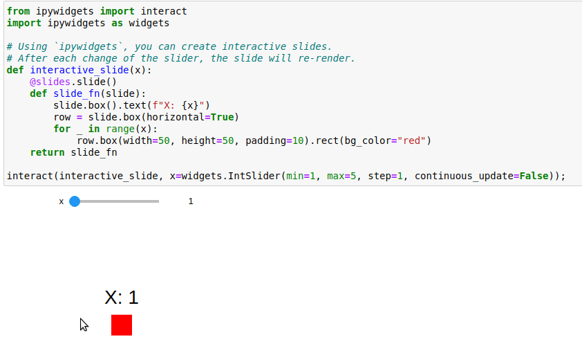

# Jupyter integration
*Elsie* has built-in support for creating slides interactively using
[Jupyter](https://jupyter.org/). If you return a box from a Jupyter notebook cell, it will be
rendered directly inside the notebook:
```python
import elsie
slides = elsie.Slides()
slide = slides.new_slide()
slide.box().text("Hello world")
slide
```
If you create slides using the [`decorator`](slides.md#decorator) approach, you need to return the
decorated function from the cell:
```python
import elsie
slides = elsie.Slides()

@slides.slide()
def hello(slide):
    slide.box().text("Hello world")
hello
```

If your slide contains multiple [fragments](revealing.md), there will be two buttons below the slide
which will let you move between the individual fragments:
```elsie
slide.box().text("Box 1")
slide.box(show="next+").text("Box 2")
slide
```

You can combine this feature with [ipywidgets](https://ipywidgets.readthedocs.io/en/latest/) to
create fully interactive slides. For example, you can create something like this:



You can see an example of Jupyter integration
[here](https://github.com/spirali/elsie/tree/master/examples/jupyter).

## Name policy inside Jupyter
The [name policy](slides.md#name-policy) is automatically set to `replace` when running inside
Jupyter. Therefore, if you re-run a cell which creates a slide with the same name as in the previous
cell execution, the previous slide will be removed. Otherwise, you would create a new slide for each
execution of a cell, which might not be what you want. To make the process of naming slides easier,
we recommend you to create slides using the [decorator](slides.md#decorator), which will name them
automatically, according to the name of the decorated function.

Note that after modifying a cell with a slide when using the `replace` policy, you should also
execute all the following cells with slides to not change the order of slides. In general, creating
slides inside Jupyter is designed for interactive experiments with complex slides. For a final
render, you should either copy your code into a Python script or restart the notebook kernel and
reexecute the whole notebook from the start.
