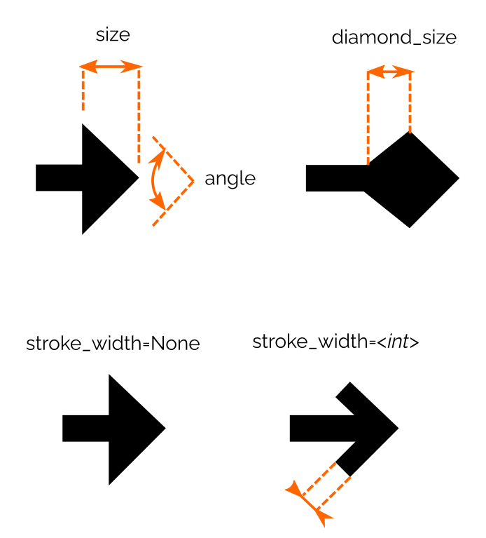

# Shapes
*Elsie* allows you to draw various SVG shapes into slides: rectangles, (poly)lines, polygons or
generic paths. On top of that, it offers an abstraction for arrow heads that can be placed on the
ends of lines or paths.

## Rectangles
You can draw rectangles using the [`rect`](elsie.boxmixin.BoxMixin.rect) method on a box. The
position and size of the rectangle will be copied from the box. You can pass the following
additional parameters:

- `color=<str or None>`: [Color](text.md#colors) used to draw the edges of the rectangle. If you
pass `None` (the default), the edges will not be drawn.
- `stroke_width=<number>`: Thickness of the drawn rectangle.
- `stroke_dasharray=<str or None>`: Pattern of dashes and gaps to used when drawing the edges of
the rectangle. You can find more about this attribute
[here](https://developer.mozilla.org/en-US/docs/Web/SVG/Attribute/stroke-dasharray).
- `bg_color=<str or None>`: Color used to fill the rectangle.
- `rx`, `ry`: Radius of
[rounded corners](https://developer.mozilla.org/en-US/docs/Web/SVG/Element/rect) of the rectangle.

An example of drawing a rectangle:
```elsie
box = slide.box(x="[50%]", y="[50%]", width="80%", height=200)
box.rect(
  bg_color="green", color="red",
  stroke_width=10, stroke_dasharray="10 4",
  rx=20, ry=20
)
```

## Lines and polygons
You can draw lines using the [`line`](elsie.boxmixin.BoxMixin.line) method and polygons using the
[`polygon`](elsie.boxmixin.BoxMixin.polygon). Both of these methods take a list of poinst as their
first argument. Each point can be defined as one of the following variants:

- A tuple `(x_value, y_value)`: Both values will be interpreted as locations relative to the top-left
corner of the parent box of the line/polygon. See
[box positioning](layout.md#positioning-boxes).
- A dynamic point obtained by calling `.p(x_value, y_value)` on some box. See
[dynamic positions](layout.md#dynamic-positions).

```elsie
slide.box(width=100, height=100).line([(0, 0), (50, 50)], color="red", stroke_width=5) 
box = slide.box().text("Hello")
slide.box().polygon([
  box.p(-20, "50%"),
  box.p("50%", -20),
  box.p("100%", "50%").add(20, 0),
  box.p("50%", "100%").add(0, 20)
], color="green")
```

You can pass [`style attributes`](elsie.boxmixin.BoxMixin.line) to lines and polygons, similarly
to rectangles.

## Arrow heads
An arrow head is defined using the [`Arrow`](elsie.arrow.Arrow) class. It takes the following
attributes:

- `size`: Size of the arrow head.
- `angle`: Main angle of arrow head.
- `stroke_width`: Thickness of the line used to draw the arrow head. If `None`, the arrow head will
be filled. 
- `inner`: Determines the shape of the arrow head. Value `1` (default) produces a normal arrow,
values larger than `1` will produce a diamond shape, values smaller than `1`
will produce a sharper arrow. See the effect in the picture below. The effect of the `inner` value
is proportional to the size of the arrow.

Arrow attributes reference image:



You can attach an arrow head to a line using the `start_arrow` and `end_arrow` parameters of the
[`line`](elsie.boxmixin.BoxMixin.line) method. Here is an example of using arrow heads:
```elsie
slide.box(width=100, height=100).line(
  [(0, 0), (50, 50)],
  color="red",
  stroke_width=5,
  start_arrow=elsie.Arrow(size=20, inner=2.0, angle=30),
  end_arrow=elsie.Arrow(size=40),
) 
```

Note: the arrow head defines only its shape, not color. The color is always taken from the line to
which the arrow head is attached.

## Paths
You can also draw arbitrary
[SVG paths](https://developer.mozilla.org/en-US/docs/Web/SVG/Tutorial/Paths) using the
[`path`](elsie.boxmixin.BoxMixin.path) method.
